# Capstone Project

# Project Name: CleanEase

An application which helps users to book their house hold cleaning services, such as Kitchen cleaning, room cleaning, garden cleaning, etc.

## Frontend deployed in Netlify

User Portal - https://cleanease-user.netlify.app/
Admin Portal - https://cleanease-admin.netlify.app/

## App deployed in Render

https://cleanease-backend-gvsh.onrender.com/

## Documentation

Using React, Express, MongoDB and node this app can help create a cleanining service request, track the request, etc.

# 💻 Tech Stack:

## Demo

Test using Postman:

- Add Service - POST (https://cleanease-backend-gvsh.onrender.com/api/service/add)
- List Service - GET (https://cleanease-backend-gvsh.onrender.com/api/service/list)
- Remove Service - POST (https://cleanease-backend-gvsh.onrender.com/api/service/remove)
- Register User - POST (https://cleanease-backend-gvsh.onrender.com/api/user/register)
- Login User - POST (https://cleanease-backend-gvsh.onrender.com/api/user/login)
- Add to Cart - POST (https://cleanease-backend-gvsh.onrender.com/api/cart/add)
- Remove from Cart - POST (https://cleanease-backend-gvsh.onrender.com/api/cart/remove)
- Get Cart Details - POST (https://cleanease-backend-gvsh.onrender.com/api/cart/get)
- User Order Details - POST (https://cleanease-backend-gvsh.onrender.com/api/order/userorders)
- Get all order Details - GET (https://cleanease-backend-gvsh.onrender.com/api/order/list)
- Update Order status - POST (https://cleanease-backend-gvsh.onrender.com/api/order/status)
- Verify Payment - POST (https://cleanease-backend-gvsh.onrender.com/api/order/verify)

## API documentation

https://documenter.getpostman.com/view/36588127/2sAXxWbA2v

## Screenshot

How to use User Portal : https://cleanease-user.netlify.app/

Functionalities: An user can Register/Login into the portal, Filter Services, Order Services, Remove services, make payment using Stripe

NOTE: Run the backend before you access the front end URL(https://cleanease-backend-gvsh.onrender.com/) - Just open this URL in a new tab, and you should see the following message "API Working".

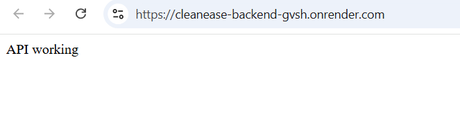

1. Login - Click the "Sign In" button.

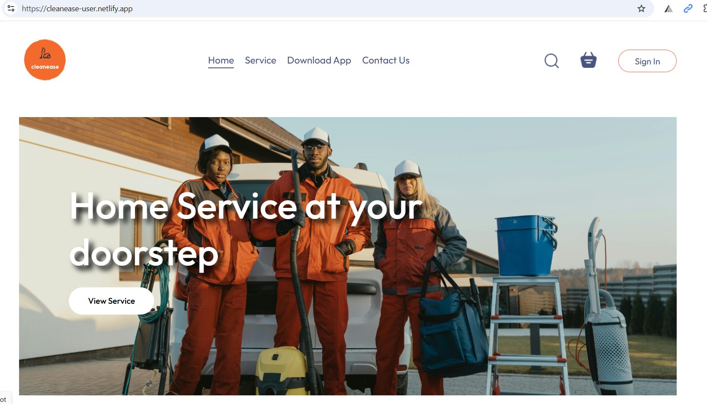

If you are a new user then select "Click here" option at the bottom to register a new user by providing a valid UserName, Email ID and Password.

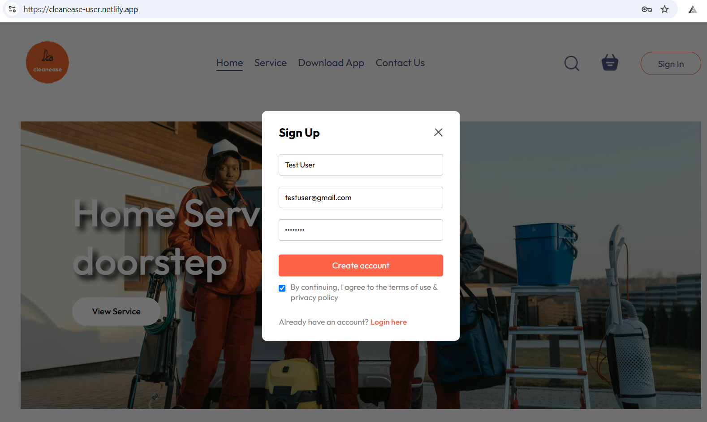

If you are an existing user then Login using your existing credentials. And you will be routed to the "home" page.

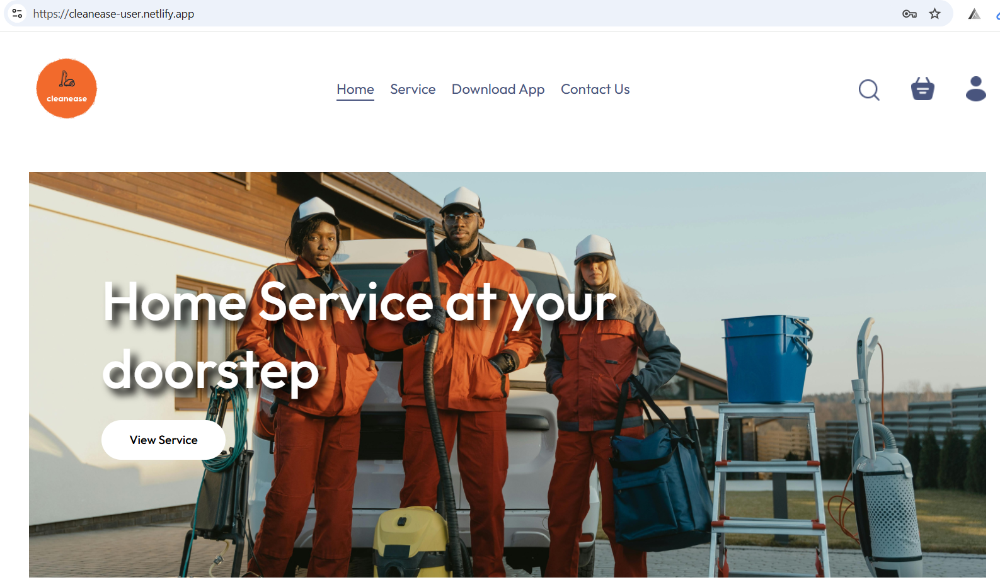

2. Explore Services - One can click on the "Services" tab to explore the existing services. By default the Home page will show all exisiting services. If you need to see a specific service, say for example: services related to "Kitchen", then select the Kitchen service item, and it will populate the exisiting services related to Kitchen services.

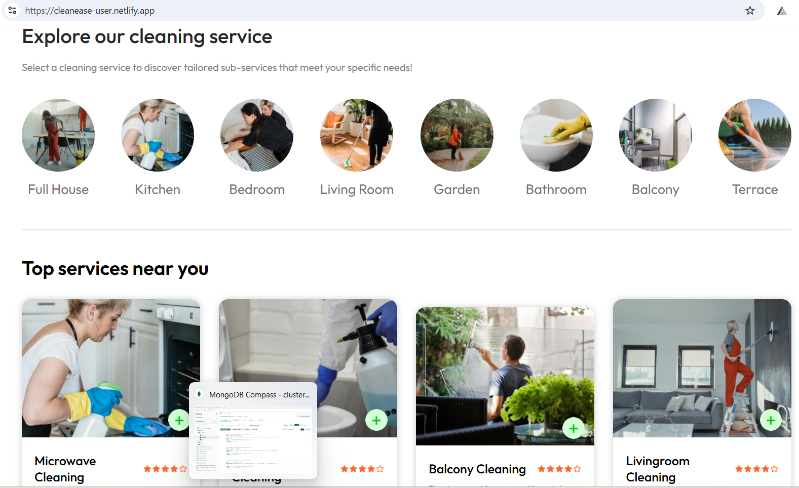

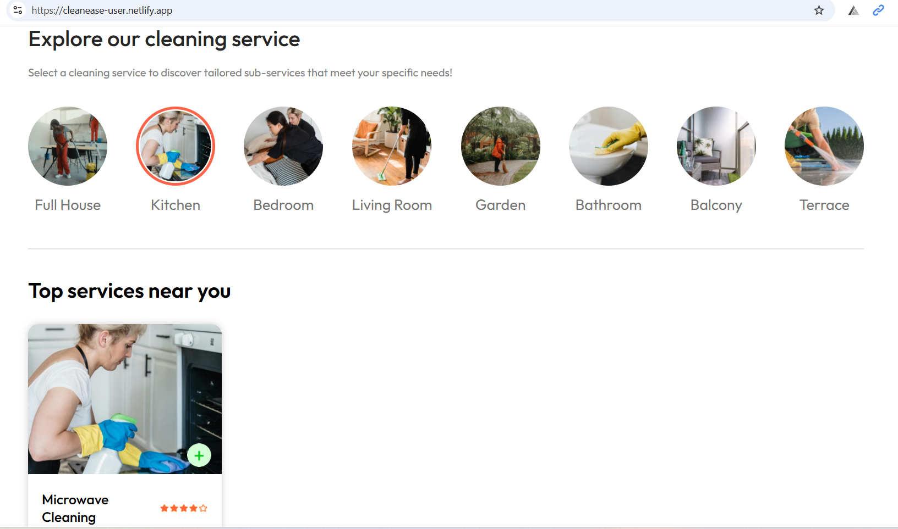

3. To add the same to the cart - click on the "+" button(add to cart icon), and the icon will change to "-"(remove item icon). The same can be reviewed or removed by click the cart button at the top, which will take you to the "cart" page.

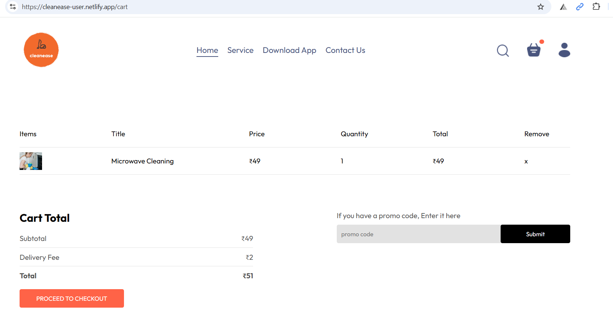

4. If you are ok to proceed with your order, then click on the "Proceed to Checkout" button. Which will take you to the "order" page.

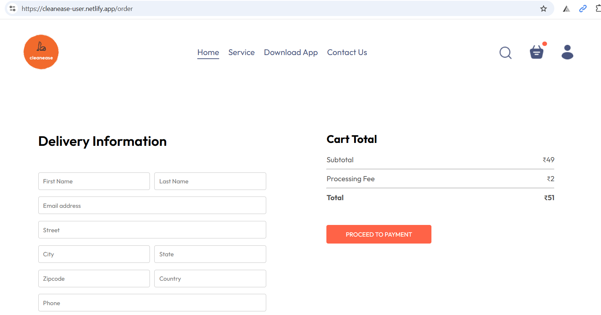

5. Enter your address, and click on "Proceed To Payment" button. Which will route you to the stripe payment page, here you need to enter the required card details. For testing purpose, please use the following dummy card number - "4000003560000008".

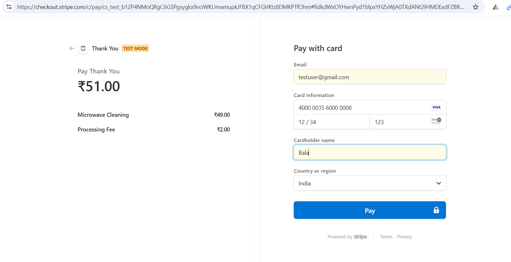

6. You will get a pop-up screen to select either "FAIL" or "COMPLETE". Select appropriate option, and here I'm selecting "COMPLETE". Which will process your order at the backend and update the Payment status to "true" and route you back to "myorders" page.

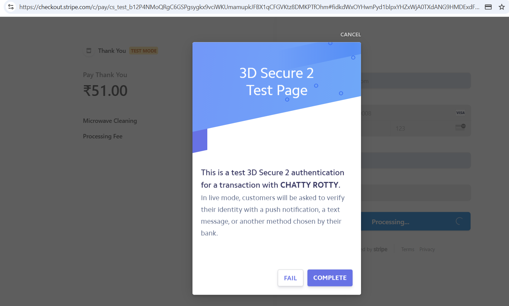

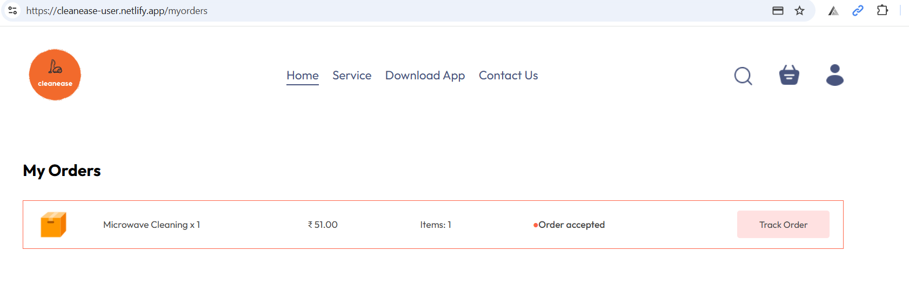

7. From here you can track your order by clicking on "Tack Order" button. By defaul the status will be "Order Accepted". When the Admin processes your order, then the status will get updated. "Service in-progress" - determines that the ordered service is in progress at your place. "Service Completed" - determines that the service has been completed successfully. An admin will update these status and the same will get reflected back on your "myorders" page when you click on "Track Order" button.

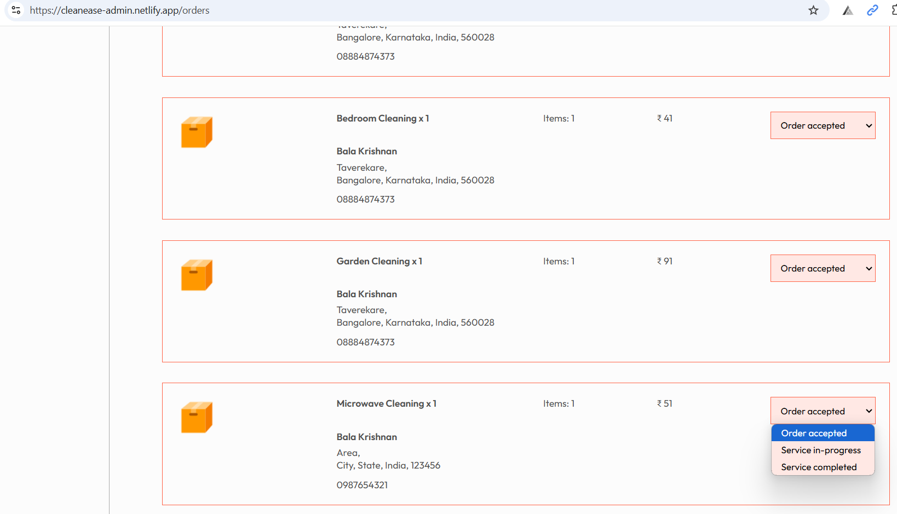

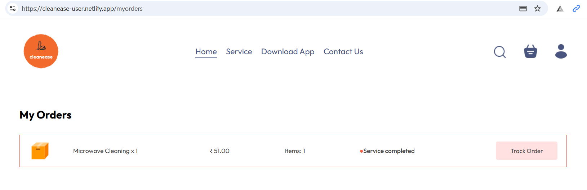

How to use Admin Portal - https://cleanease-admin.netlify.app/

Functionalities: An admin can add new service, remove existing service, view existing services, view orders, update order status.

NOTE: Run the backend before you access the front end URL(https://cleanease-backend-gvsh.onrender.com/) - Just open this URL in a new tab, and you should see the following message "API Working".

1. By default you will be landed in the following page.

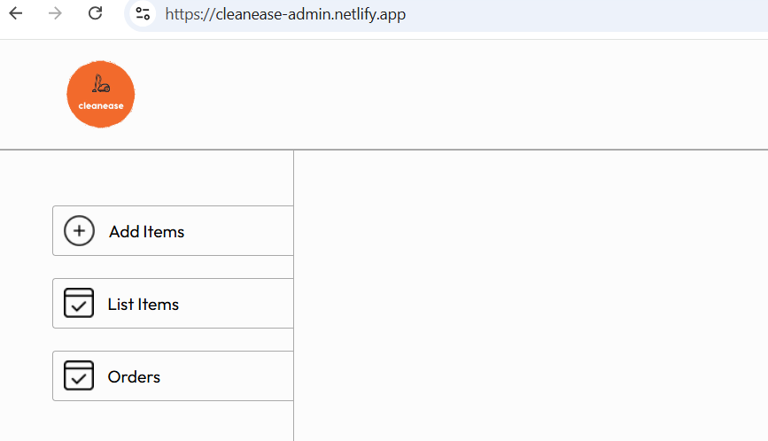

2. As an admin, you can Add services by clicking on the "Add Services" item from the sidebar. Here you can fill the required information and add click on "Add" button. This will reflect in User portal(the same can be checked by refreshing the user portal)

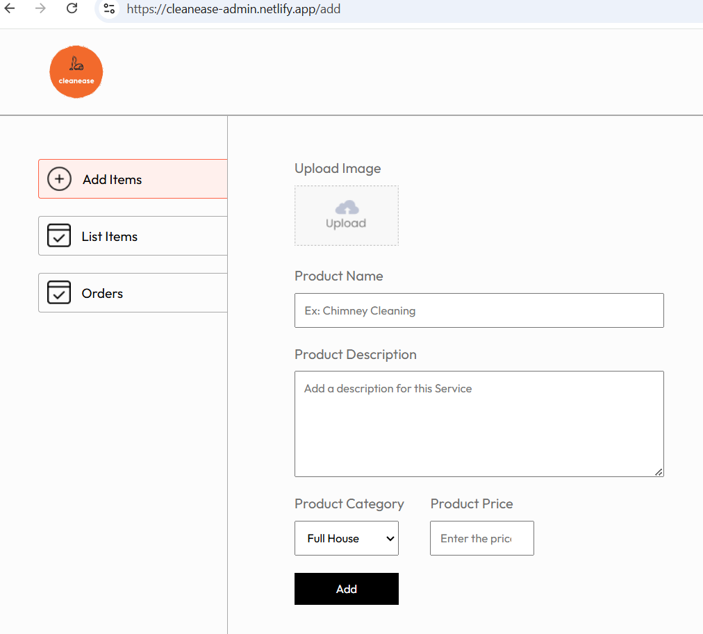

3. An admin can remove services from the "list" page by click on the "List Services" item from the sidebar. Upon clicking this item, you will be listed with the existing services, and you can remove the same by clicking on the "X" icon from the "Action" column. The same will reflect in User portal(the same can be checked by refreshing the user portal)

4. Click on "Orders" item from the sidebar to list the existing and to review the new orders. From here the admin can check the orders, update the order status.

Order accepted - When a user places an order, then this will be the default status
Service in-progress - Admin updates to this status, When service team has reached user's place, and the service is in progress
Service completed - Admin updates to this status, when the service team has completed the requested Cleaning service/s

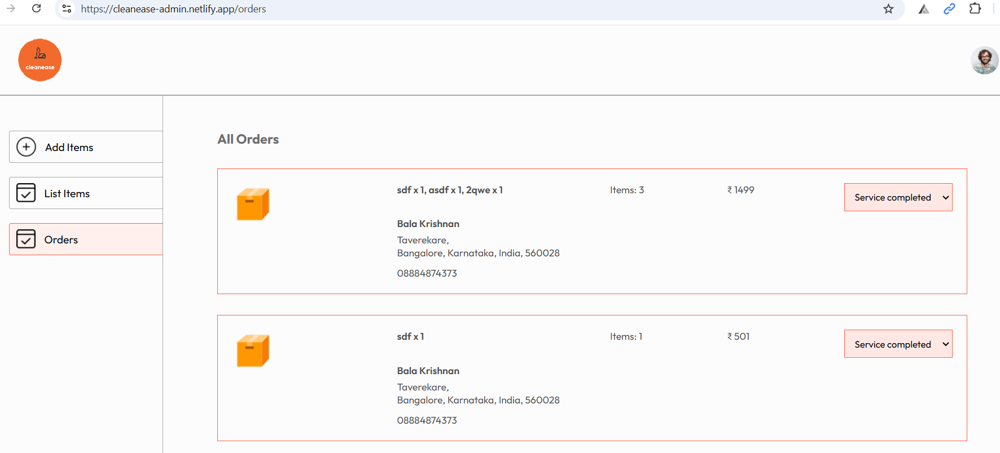

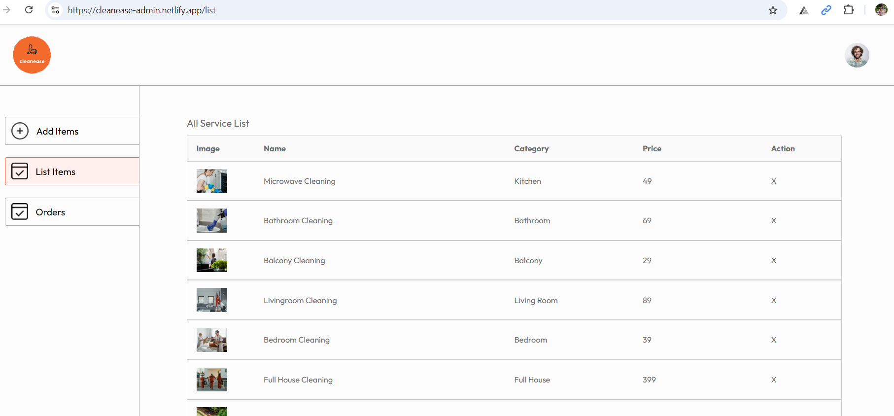

## Installation

To run this app locally - follow the below steps.

- Download all three repositories(Cleanease-Backend, Cleanease-Frontend, Cleanease-Admin)
- Install dependencies using npm install
- Start the development server with "npm run dev"(for Frontend, and Admin projects), "npm run server"(for backend project)
- Using postman test the API endpoints(if you face any issues accessing the Render deployment URL then you can use "http://localhost:5173/"(for frontend), "http://localhost:5174/"(for admin portal) instead of render deployment URL). And the following code change is required in backend's .env file(FRONTEND_URL = "http://localhost:5173"), admin's assets.js file(export const url = 'http://localhost:4000') and in the frontend's StoreContext.jsx file update the url as "http://localhost:4000".
